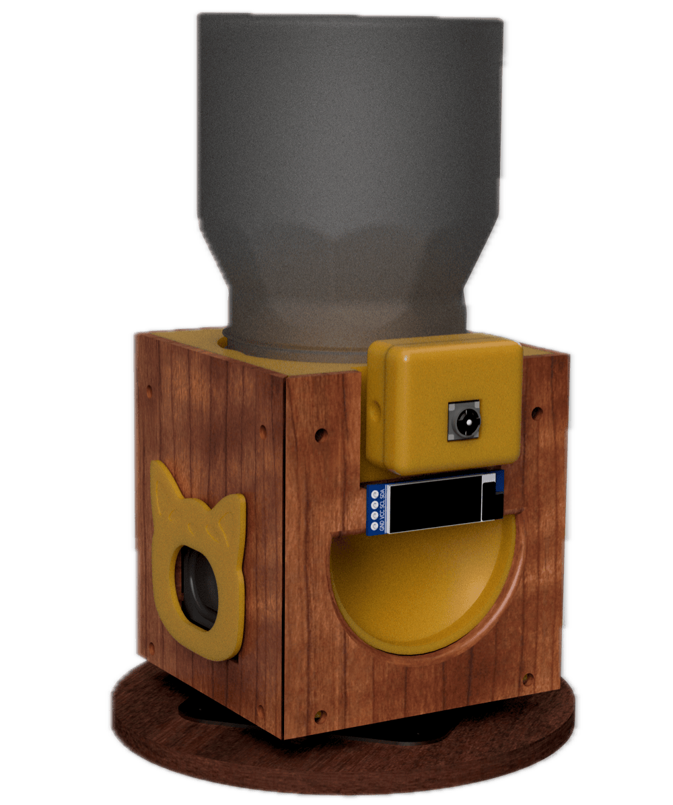
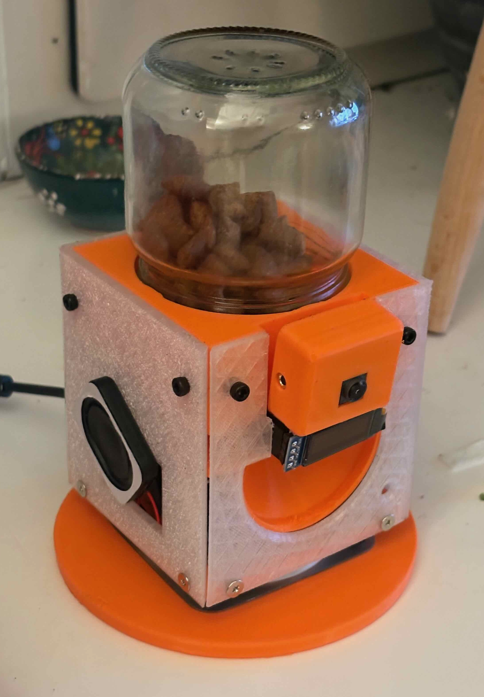
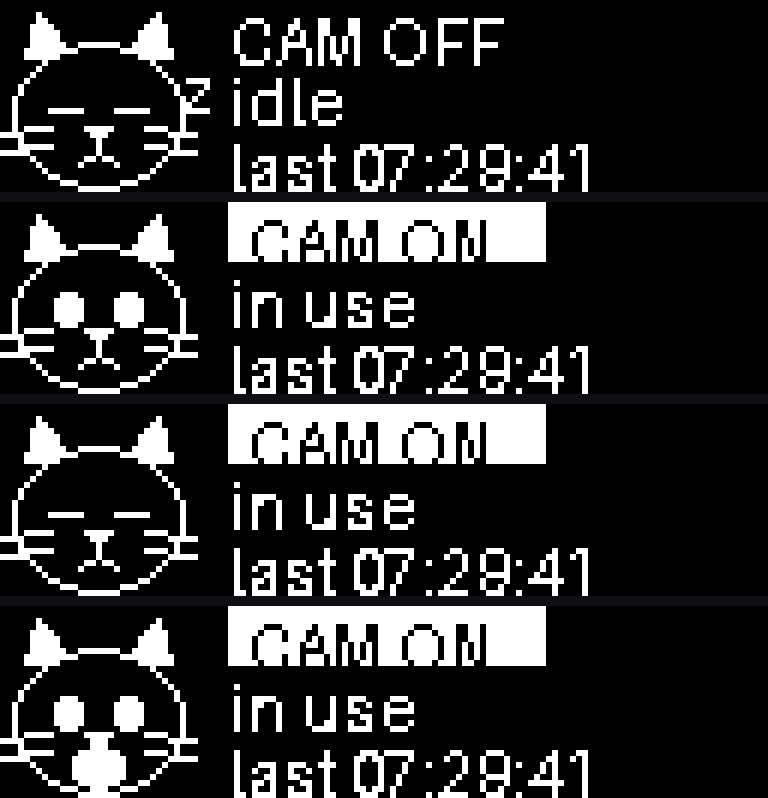

# LillyCam 🐱

A DIY cat treat dispenser with live camera, two-way audio, and remote control —
built on a Raspberry Pi Zero W (or a Zero 2 W for the "Pro" build).

<p align="center">
  
  
</p>

LillyCam remixes the classic cereal-dispenser-as-pet-feeder concept with a proper
monitoring stack: MJPEG video streaming, walkie-talkie audio, servo-controlled
rotation, OLED status display, and a web interface you can access from anywhere
via Tailscale VPN.

Everything is cat-themed. The speaker grille is a Popcat. The camera has a cat-eye
surround. The mic has a paw print. The corner pieces are fish.

## Features

- **Live video** — 640x480 @ 15fps MJPEG stream via Flask, up to 1280x720 @ 30fps on Pro (off by default at boot; wake it from the web UI)
- **Treat dispensing** — 28BYJ-48 5V stepper motor with a cylindrical funnel insert
- **Base rotation** — SG90 servo for panning the whole unit
- **Two-way audio** — INMP441 I2S mic + MAX98357A amp (half-duplex, push-to-talk)
- **Status display** — SSD1306 OLED with an animated cat face (sleeps when the camera is off, wakes when on) plus connection status and last dispense time
- **Single-connection control** — only one device drives LillyCam at a time (saves resources, avoids servo/dispenser conflicts); a second device sees a lock screen and can take over. The camera turns off automatically when the last viewer leaves
- **Full-res stills** — 3280x2464 captures saved with timestamps
- **Remote access** — Tailscale VPN, accessible from phone or laptop
- **3D printed enclosure** — cat-themed decorative panels (editable STEP + print-ready STL in [`3d-models/`](3d-models/))

<p align="center">
  
  <br><em>The OLED cat: sleeps when the camera is off, wakes when on, and pops on dispense.</em>
</p>

## Two models

LillyCam comes in two variants from one codebase. Pick yours with `LILLYCAM_MODEL`
in `.env` — it sets sensible per-model defaults, and any individual setting can
still be overridden:

| | **LillyCam** (`standard`) | **LillyCam Pro** (`pro`) |
|---|---|---|
| Computer | Pi Zero W v1.1 (single-core) | Pi Zero 2 W (quad-core) |
| Camera | Camera Module v2 (IMX219) | Camera Module 3 (IMX708, autofocus) |
| Stream default | 640x480 @ 15fps | 1280x720 @ 30fps |
| OLED animation | 6 fps | 12 fps |

The GPIO wiring is identical for both (same 40-pin header, same
[`pins.py`](lillycam/pins.py)) — only the board, camera, and software defaults
differ. Both share the web UI, home-screen PWA install, and opt-in Web Push; the
Pro's extra CPU headroom is what makes the higher-res stream and roadmap features
(listen toggle, servo tracking) practical.

## Hardware

| Component | Model | Interface |
|-----------|-------|-----------|
| Computer | Raspberry Pi Zero W v1.1 | — |
| Camera | Pi Camera v2 (IMX219) | CSI ribbon |
| Stepper motor | 28BYJ-48 5V | ULN2003 driver |
| Servo | SG90 | GPIO 12 (HW PWM1) |
| Microphone | INMP441 | I2S |
| Amplifier | MAX98357A | I2S |
| Speaker | 25x35mm 4ohm 3W | via MAX98357A |
| Display | SSD1306 0.91" OLED | I2C |

Full BOM with sourcing links: [docs/hardware.md](docs/hardware.md)

## GPIO Pinout

All pin assignments live in [`lillycam/pins.py`](lillycam/pins.py).
The diagram below shows the complete 40-pin header allocation:



**Subsystem summary:**

| Subsystem | GPIO pins (BCM) | Physical pins |
|-----------|----------------|---------------|
| Stepper (ULN2003) | 17, 27, 22, 23 | 11, 13, 15, 16 |
| Servo (SG90) | 12 (PWM1) | 32 |
| I2S bus (shared) | 18 (BCLK), 19 (LRCLK) | 12, 35 |
| Amp (MAX98357A) | 21 (DIN) | 40 |
| Mic (INMP441) | 20 (DOUT) | 38 |
| OLED (SSD1306) | 2 (SDA), 3 (SCL) | 3, 5 |

> **Why is the servo on GPIO 12 instead of GPIO 18?**
> GPIO 18 is the default for both hardware PWM0 and I2S BCLK. Since we need I2S
> for audio, the servo was moved to GPIO 12 (hardware PWM1) to avoid the conflict.

## Quick Start

### Prerequisites

- Raspberry Pi Zero W (standard) or Zero 2 W (Pro) with Raspberry Pi OS
- All hardware connected per [docs/hardware.md](docs/hardware.md)
- I2S overlays enabled per [docs/pi-setup.md](docs/pi-setup.md)
- SSH access (USB gadget Ethernet or WiFi)

### Install

```bash
git clone https://github.com/sapertuz/lillycam.git
cd lillycam
python3 -m venv .venv
source .venv/bin/activate
pip install -r requirements.txt
cp .env.example .env        # then set LILLYCAM_MODEL=standard or pro
```

### Test peripherals individually

Each script in `examples/` tests one peripheral in isolation.
Run them in order to verify your wiring:

```bash
# 1. OLED (simplest, good sanity check)
python examples/test_oled.py

# 2. Stepper motor
python examples/test_stepper.py --steps 200

# 3. Servo
python examples/test_servo.py --angle 90

# 4. Camera still
python examples/test_camera.py

# 5. MJPEG stream (open http://<pi-ip>:8080 in browser)
python examples/test_stream.py

# 6. Microphone (records 5s to test.wav)
python examples/test_mic.py

# 7. Speaker (plays test tone)
python examples/test_speaker.py

# 8. Audio loopback (records then plays back)
python examples/test_audio_loopback.py
```

### Run the full application

```bash
python -m lillycam
```

Then open `http://<pi-ip>:5000` in your browser.

### Remote access (Tailscale)

LillyCam is designed for remote access over [Tailscale](https://tailscale.com), a
private VPN. See [docs/pi-setup.md](docs/pi-setup.md) for install instructions.

Once set up, access LillyCam from any device on your Tailscale network at
`https://<tailscale-hostname>:5000`. HTTPS is required for the push-to-talk
microphone feature to work (browser security restriction).

### Run as a service

```bash
sudo cp config/lillycam.service /etc/systemd/system/
sudo systemctl daemon-reload
sudo systemctl enable lillycam
sudo systemctl start lillycam
```

LillyCam will now start automatically on boot and restart on crash.

Common service commands:

```bash
sudo systemctl restart lillycam   # restart after a code change
sudo systemctl stop lillycam      # stop
sudo systemctl status lillycam    # check if running
sudo journalctl -u lillycam -f    # live logs
```

## Project Structure

```
lillycam/
├── README.md              ← you are here
├── CLAUDE.md              (project context for AI-assisted development)
├── LICENSE                (Apache 2.0)
├── NOTICE                 (attribution)
├── pyproject.toml
├── requirements.txt
├── .env.example           (pin overrides, stream settings)
├── docs/                  (hardware BOM, assembly guide, Pi setup)
├── config/                (ALSA, boot overlays, systemd unit)
├── 3d-models/             (CAD: editable STEP + print-ready STL)
│   ├── step/              (editable source, opens in any CAD tool)
│   └── stl/               (print-ready meshes)
├── examples/              (one script per peripheral, standalone tests)
├── lillycam/              (main application)
│   ├── pins.py            (single source of truth for GPIO assignments)
│   ├── camera.py          (picamera2 wrapper)
│   ├── stepper.py         (treat dispensing)
│   ├── servo.py           (base rotation)
│   ├── audio.py           (half-duplex mic + speaker)
│   ├── display.py         (OLED status)
│   ├── app.py             (Flask factory)
│   └── web/               (routes, templates, static)
└── tests/                 (unit tests with mocked GPIO)
```

## Power

A single DC barrel jack feeds a toggle switch, then a perfboard that distributes
power through polyfused (PPTC) branches:

- ~1A polyfuse: 5V to GPIO pins 2/4, powers Pi + camera + I2S devices + servo + stepper

The Pi is powered via GPIO 5V pins (bypassing the onboard micro-USB polyfuse),
which is why the external polyfuse is required.

## License

Apache License 2.0. See [LICENSE](LICENSE) and [NOTICE](NOTICE).

## Acknowledgments

- Hardware design inspired by ["Pavlov's Electronic Treat Dispenser (PET Dispenser)"](https://www.instructables.com/Pavlovs-Electronic-Treat-Dispenser-PET-Dispenser/) on Instructables
- [picamera2](https://github.com/raspberrypi/picamera2) by the Raspberry Pi Foundation
- [luma.oled](https://github.com/rm-hull/luma.oled) by Richard Hull
